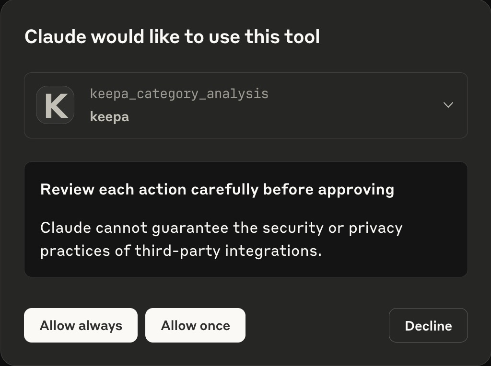
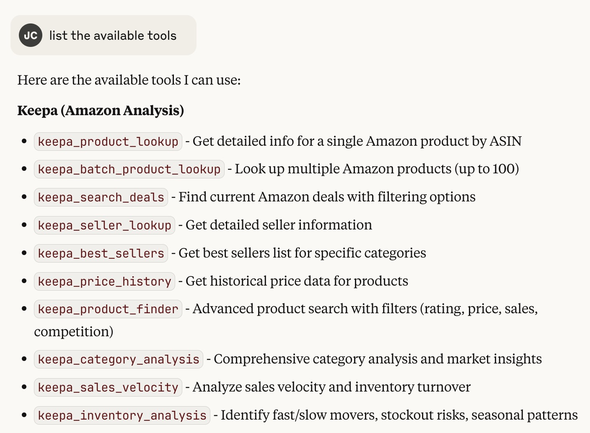

# Amazon Marketplace Intelligence Tool

A Model Context Protocol (MCP) server that gives Claude access to Keepa's product and sales data through a more approachable, conversational interface. It simplifies Keepa's complex, engineer-oriented design, making it easier to explore product research, sales trends, inventory signals, and competitive analytics without needing to master Keepa's native UI.

## ✨ **Core Capabilities**

### 📊 **Advanced Sales Velocity & Inventory Optimization** 
- **🚀 Sales Velocity Analysis**: Identify fast-moving products that generate cash flow (20+ units/day)
- **📈 Inventory Turnover Intelligence**: Avoid slow movers that tie up capital (<5 units/month)
- **⚠️ Stockout Risk Management**: Automated reorder alerts and quantity recommendations
- **📅 Seasonal Pattern Recognition**: Q4 holiday, back-to-school, and quarterly demand analytics
- **💰 Cash Flow Optimization**: Target 20-35 day inventory levels for maximum ROI

### 🔍 **Professional Product Research & Discovery**
- **🎯 Advanced Product Finder**: 20+ filters including rating, price, competition, and sales volume
- **⭐ Market Opportunity Scoring**: Find high-opportunity, low-competition products
- **📋 Batch Analysis**: Process up to 100 ASINs simultaneously for portfolio analysis
- **💡 FREE Analytics Integration**: Statistics Object provides ongoing velocity data at no extra cost
- **🏆 Competition Intelligence**: Seller count analysis and market saturation scoring

### 💎 **Deal Discovery & Profit Analysis**
- **💰 Enhanced Deal Discovery**: Find deals with 20%+ discounts and profit potential scoring
- **⚡ Lightning Deal Monitoring**: Track time-sensitive deals with urgency alerts
- **🎯 Profit Potential Calculator**: Automated profit margin and ROI analysis
- **🌟 Prime-Eligible Filtering**: Focus on high-converting Prime products

### 🏢 **Category & Market Intelligence**
- **📊 Comprehensive Category Analysis**: Market size, competition levels, and brand concentration
- **🎯 Opportunity Scoring**: Algorithmic scoring of market entry opportunities (0-100%)
- **📈 Performance Benchmarking**: Compare against top performers in any category
- **💡 Strategic Recommendations**: AI-generated market entry and optimization strategies

## 🛠️ **Available MCP Tools**

> **💬 Natural Language Interface**: Simply ask Claude questions - no JSON or technical syntax required! Claude automatically uses these tools based on your requests.

### 🔍 **Core Product Intelligence**
1. **`keepa_product_lookup`** - Deep product analysis with FREE Statistics Object analytics
2. **`keepa_batch_product_lookup`** - Portfolio analysis for up to 100 ASINs simultaneously  
3. **`keepa_price_history`** - Historical pricing trends and market stability analysis

### 🎯 **Advanced Market Discovery**  
4. **`keepa_product_finder`** - **20+ advanced filters** for opportunity discovery
5. **`keepa_category_analysis`** - **Comprehensive market intelligence** with opportunity scoring
6. **`keepa_search_deals`** - **Enhanced deal discovery** with profit potential analysis
7. **`keepa_best_sellers`** - Category rankings and trending product identification

### 📊 **Sales Velocity & Cash Flow Optimization**
8. **`keepa_sales_velocity`** - **Industry-standard velocity calculations** for inventory turnover
9. **`keepa_inventory_analysis`** - **Portfolio management** with stockout risk assessment

### 🏢 **Competitive Intelligence**
10. **`keepa_seller_lookup`** - Seller performance analysis and competitive research

## Prerequisites

1. **Keepa API Key**: Sign up at [https://keepa.com/#!api](https://keepa.com/#!api)
   - Keepa requires a paid subscription with token-based pricing
   - Different endpoints have different token costs
   - Product history calls are more expensive than basic product info

2. **Node.js**: Version 18 or higher

## Installation

1. Clone or download this repository
2. Install dependencies:
   ```bash
   npm install
   ```

3. Build the TypeScript code:
   ```bash
   npm run build
   ```

4. You'll configure your Keepa API key in the Claude Desktop config (next section)

## Configuration

### Environment Variables

The MCP server accepts these environment variables (configured in Claude Desktop):
- `KEEPA_API_KEY` (required): Your Keepa API key
- `KEEPA_RATE_LIMIT_DELAY` (optional): Delay between requests in milliseconds (default: 1000)
- `KEEPA_TIMEOUT` (optional): Request timeout in milliseconds (default: 30000)

### Claude Desktop Configuration

**Location**: 
- **macOS**: `~/Library/Application Support/Claude/claude_desktop_config.json`
- **Windows**: `%APPDATA%/Claude/claude_desktop_config.json`

**Note**: If the file doesn't exist, create it. Some installations may have `config.json` instead - copy it to the correct filename:
```bash
cp ~/Library/Application\ Support/Claude/config.json ~/Library/Application\ Support/Claude/claude_desktop_config.json
```

Add to your Claude Desktop `claude_desktop_config.json`:

```json
{
  "mcpServers": {
    "keepa": {
      "command": "node",
      "args": ["/path/to/keepa_mcp/dist/index.js"],
      "env": {
        "KEEPA_API_KEY": "your_keepa_api_key_here"
      }
    }
  }
}
```

**Replace `/path/to/keepa_mcp` with your actual path and `your_keepa_api_key_here` with your Keepa API key.**

**⚠️ Important**: After making any changes to your `claude_desktop_config.json` file, you must completely close Claude Desktop (Cmd+Q on macOS or Alt+F4 on Windows) and restart it for the changes to take effect.

### **Grant MCP Server Permissions**

When you first start Claude Desktop with the MCP server configured, you'll see a permission dialog. Click **"Allow"** to grant the server access:



*You must grant these permissions for the Keepa tools to appear and function properly.*

## 🔧 Troubleshooting

### **If MCP tools don't appear in Claude Desktop:**

1. **Check Claude Desktop version**: Ensure you're running version 0.7.0 or later (MCP support required)
   - Click "Claude" menu → "About Claude"

2. **Verify config file location and format**:
   ```bash
   # Check if file exists
   ls -la ~/Library/Application\ Support/Claude/claude_desktop_config.json
   
   # Validate JSON format
   cat ~/Library/Application\ Support/Claude/claude_desktop_config.json
   ```

3. **Test MCP server manually**:
   ```bash
   cd /path/to/keepa_mcp
   npm run build
   KEEPA_API_KEY=your_key_here node dist/index.js
   ```

4. **Complete restart**: Force quit Claude Desktop (Cmd+Q) and relaunch

5. **Simplified config**: Try removing other settings and use minimal config:
   ```json
   {
     "mcpServers": {
       "keepa": {
         "command": "node",
         "args": ["/full/path/to/keepa_mcp/dist/index.js"],
         "env": {
           "KEEPA_API_KEY": "your_keepa_api_key_here"
         }
       }
     }
   }
   ```

6. **Check for logs**: Look for error messages in Claude Desktop console or system logs

### **Common Issues:**
- **Wrong file path**: Ensure the path to `dist/index.js` is absolute and correct
- **Missing build**: Run `npm run build` after any code changes
- **Invalid JSON**: Use a JSON validator to check config file syntax
- **Missing API key**: Make sure `KEEPA_API_KEY` is set in the env section of your config

### **✅ Verify MCP Server Connection**
Once you've configured everything and restarted Claude Desktop, you should see your Keepa tools available:



*The Keepa MCP server provides 10 powerful tools for Amazon marketplace intelligence, sales velocity analysis, and inventory management.*

If you see these tools in Claude Desktop, your MCP server is successfully connected and ready to use!

## 🚀 **Professional Use Cases & Examples**

> **✅ Verify Setup**: After configuration, ask Claude any of these questions to test your MCP server connection.

### 🎯 **Sales Velocity Optimization**
**Find Cash Flow Champions:**
```
"Use Keepa to find products in Electronics that sell 50+ units daily with high inventory turnover"
```

**Avoid Cash Flow Killers:**
```
"Show me slow-moving products in my category that tie up capital for 60+ days using Keepa"
```

**Portfolio Health Check:**
```
"Analyze my current inventory for stockout risks and cash flow optimization using Keepa ASINs: [your ASINs]"
```

### 💎 **Market Opportunity Discovery**
**Find High-Opportunity Niches:**
```
"Use Keepa to find low-competition products in Home & Kitchen with 4+ star ratings and 1000+ monthly sales"
```

**Category Market Intelligence:**
```
"Analyze the Pet Supplies category for market opportunities, competition levels, and profit potential using Keepa"
```

**Competition Gap Analysis:**
```
"Find products with high sales but fewer than 5 sellers in the Beauty category using Keepa"
```

### 🔥 **Deal Hunting & Profit Analysis**  
**High-Margin Deal Discovery:**
```
"Find current Amazon Lightning Deals with 30%+ discounts and high profit potential using Keepa"
```

**Prime Deal Intelligence:**
```
"Show me Prime-exclusive deals under $100 with 4+ star ratings that could be profitable using Keepa"
```

### 📊 **Advanced Analytics & Forecasting**
**Seasonal Planning:**
```
"Analyze seasonal patterns for Holiday products and recommend inventory levels for Q4 using Keepa"
```

**Performance Benchmarking:**
```
"Compare my product's sales velocity against top performers in its category using Keepa ASIN: [your ASIN]"
```

**Market Trend Analysis:**
```
"Identify trending products in Electronics with accelerating sales velocity using Keepa"
```

---

## 🎯 **Example Output**

### **📈 Sales Velocity Analysis Output**
```
✅ Electronics Portfolio Analysis Complete!

📊 Portfolio Overview:
- Total Products: 25
- Average Turnover Rate: 18.5 times/year
- Portfolio Health: Excellent - High velocity, low risk

📈 Performance Metrics:
- Average Velocity: 145.2 units/month
- Total Revenue Velocity: $2,847.33/day
- Average Days Inventory: 22 days

⚠️ Risk Assessment:
- High Risk Products: 2 (8%)
- Fast Movers (≥30/month): 76%
- Slow Movers (<10/month): 8%

💡 Strategic Recommendations:
🚀 Strong portfolio velocity - maintain current strategy
🟡 Monitor 2 products with stockout risks
📈 Focus marketing on accelerating trend products
🎯 Optimal inventory levels for maximum cash flow
```

### **🎯 Market Opportunity Discovery Output**
```
📊 Home & Kitchen Category Analysis:

🏷️ Market Overview:
- Category Size: 2.3M+ products
- Average Price: $34.67
- Competition Level: Medium
- Opportunity Score: 78%

💡 Key Insights:
• Budget-friendly category with high volume potential
• Quality improvement opportunities exist (avg 3.8★)  
• 15% of products have fewer than 5 sellers
• Growing trend toward eco-friendly products

🎯 Top Opportunities:
1. Kitchen gadgets $15-45 price range
2. Storage solutions with premium materials  
3. Smart home integration products
4. Seasonal/holiday-themed items

💰 Profit Potential: HIGH
🏆 Market Entry Difficulty: LOW-MEDIUM
```

*These examples show the level of professional marketplace intelligence you'll receive from the Keepa MCP server.*

## 🎯 **Advanced Tool Capabilities**

> **💬 Natural Interface**: Ask Claude questions in plain English - no technical syntax needed! Each tool automatically includes **FREE Statistics Object integration** for ongoing sales velocity and inventory analytics.

### 🔍 **Core Product Intelligence**

#### 1. **Advanced Product Lookup** (`keepa_product_lookup`)
**Includes Statistics Object data for sales velocity and inventory analytics**

**💬 Real-World Examples:**
- *"Use Keepa to analyze ASIN B08N5WRWNW with sales velocity and inventory turnover data"*
- *"Get comprehensive market analysis for this product B08C1W5N87 including competitor pricing"*
- *"Look up B07YTK3YQD with 90-day price trends and stockout risk assessment"*

**✨ Key Features:**
- **FREE ongoing analytics** via Statistics Object integration
- Sales velocity calculations (daily/weekly/monthly)
- Inventory turnover metrics and stockout risk scoring
- Price history with market stability analysis
- Competition analysis and opportunity scoring

#### 2. **Portfolio Analysis** (`keepa_batch_product_lookup`)  
**Process up to 100 ASINs simultaneously with comprehensive analytics**

**💬 Portfolio Management Examples:**
- *"Analyze my entire product portfolio for velocity and risk using Keepa ASINs: [100 ASINs]"*
- *"Compare sales performance across my top 25 products using Keepa batch analysis"*
- *"Get competitive intelligence on these competitor ASINs with market positioning data"*

**✨ Professional Features:**
- **Batch processing up to 100 ASINs** in a single request
- **Portfolio health scoring** and risk assessment
- **Comparative sales velocity analysis** across products
- **Market position benchmarking** against competitors
- **Cash flow impact analysis** for inventory decisions

### 🎯 **Advanced Market Discovery**

#### 3. **Enhanced Deal Discovery** (`keepa_search_deals`)
**Professional profit analysis with lightning deal monitoring**

**💬 Profit-Focused Examples:**
- *"Find Lightning Deals with 30%+ discounts and high profit potential using Keepa"*
- *"Show me Prime deals under $100 with 4+ stars that could generate $50+ daily profit"*
- *"Discover warehouse deals with profit margins above 25% using Keepa"*

**✨ Advanced Features:**
- **Enhanced profit potential scoring** with ROI calculations
- **Lightning deal urgency alerts** with time remaining
- **Deal classification system** (Lightning, Coupon, Promotion, Regular)
- **Competition level assessment** for deal products
- **Sales trend analysis** (Improving, Stable, Declining)

#### 4. **Professional Product Finder** (`keepa_product_finder`)
**20+ advanced filters for opportunity discovery**

**💬 High-Opportunity Searches:**
- *"Find products in Home & Kitchen with 4+ stars, 1000+ monthly sales, and fewer than 5 competitors"*
- *"Discover profitable products under $50 with high velocity and low competition using Keepa"*
- *"Search for Prime-eligible products with accelerating sales trends in Electronics"*

**✨ Key Capabilities:**
- **20+ professional filters** including rating, price, sales, competition
- **Market opportunity scoring** for each product found
- **Competition intelligence** with seller count analysis
- **Sales volume filtering** for cash flow optimization
- **Prime eligibility focus** for higher conversion rates

### 📊 **Sales Velocity & Cash Flow Optimization**

#### 5. **Sales Velocity Analysis** (`keepa_sales_velocity`)
**Industry-standard velocity calculations for inventory optimization**

**💬 Cash Flow Examples:**
- *"Find fast-moving products in Electronics that turn inventory every 15-20 days using Keepa"*
- *"Identify products selling 50+ units daily with high revenue velocity using Keepa"*
- *"Analyze my ASINs for inventory turnover and cash flow optimization using Keepa"*

**✨ Professional Metrics:**
- **Daily/weekly/monthly sales velocity** with trend analysis
- **Inventory turnover calculations** (times per year)
- **Revenue velocity analysis** ($$ per day)
- **Stockout risk scoring** with reorder recommendations
- **Cash flow optimization** targeting 20-35 day inventory levels

#### 6. **Portfolio Management** (`keepa_inventory_analysis`)
**Comprehensive inventory optimization with risk assessment**

**💬 Portfolio Optimization Examples:**
- *"Analyze my inventory for fast movers vs slow movers and optimize my portfolio using Keepa"*
- *"Identify stockout risks and generate reorder recommendations for my ASINs using Keepa"*
- *"Get seasonal patterns analysis for Q4 holiday inventory planning using Keepa"*

**✨ Advanced Analytics:**
- **Portfolio health scoring** (Excellent/Good/Fair/Poor)
- **Fast mover identification** (≥30 units/month)
- **Slow mover alerts** (<10 units/month requiring attention)
- **Seasonal pattern recognition** with quarterly recommendations
- **Strategic recommendations** with emoji-coded action items

### 🏢 **Market Intelligence & Competitive Analysis**

#### 7. **Category Analysis** (`keepa_category_analysis`)
**Comprehensive market intelligence with opportunity scoring**

**💬 Market Intelligence Examples:**
- *"Analyze the Home & Kitchen market for opportunities, competition levels, and profit potential using Keepa"*
- *"Get comprehensive market intelligence on Pet Supplies including top brands and pricing trends using Keepa"*
- *"Identify market gaps in Electronics category with opportunity scoring using Keepa"*

**✨ Intelligence Features:**
- **Market opportunity scoring** (0-100% algorithmic scoring)
- **Competition analysis** with market saturation assessment
- **Price distribution analysis** across budget/mid/premium/luxury segments
- **Brand concentration metrics** and top performer identification
- **Strategic market entry recommendations** with actionable insights

---

## 💡 **Why Choose Keepa MCP Server?**

### **🚀 Professional-Grade Analytics**
- **FREE Statistics Object Integration**: Ongoing sales velocity and inventory analytics at no extra cost
- **Industry-Standard Calculations**: Same formulas used by 7-figure Amazon sellers
- **Real-Time Intelligence**: Access to 3+ billion products with live market data

### **⚡ Advanced Automation**  
- **Natural Language Interface**: No technical knowledge required - just ask Claude questions
- **20+ Advanced Filters**: Find high-opportunity products with surgical precision
- **Batch Processing**: Analyze up to 100 products simultaneously

### **📊 Cash Flow Optimization**
- **Velocity-Based Decisions**: Avoid slow-moving inventory that ties up capital
- **Stockout Risk Management**: Automated alerts and reorder recommendations
- **Seasonal Intelligence**: Q4 holiday, back-to-school, and quarterly patterns

---

## 🎯 **Advanced Features Breakdown**

### **🔥 FREE Statistics Object Integration**
Every product lookup automatically includes:
- **Sales velocity data** (daily/weekly/monthly units sold)
- **Inventory turnover metrics** (times per year)
- **Stockout risk scoring** (Low/Medium/High)
- **Buy box price tracking** with competition analysis
- **Market trend identification** (Accelerating/Stable/Declining)

### **📊 20+ Professional Filters**
The Product Finder includes enterprise-grade filtering:
- **Sales Volume**: Find products selling 1000+ units monthly
- **Competition Level**: Target products with <5 sellers
- **Rating Quality**: Focus on 4+ star products only
- **Price Ranges**: Budget ($0-25), Mid ($25-75), Premium ($75-200+)
- **Prime Eligibility**: Higher conversion rates
- **Review Count**: Products with established market validation
- **Shipping Costs**: Include shipping in profit calculations
- **Seasonal Trends**: Identify trending vs declining products

### **🎯 Market Opportunity Scoring**
Advanced algorithmic scoring (0-100%) considers:
- **Competition Density**: Fewer sellers = higher opportunity
- **Quality Gaps**: Below 3.8 stars = improvement opportunity  
- **Price Sweet Spots**: $20-150 optimal for most categories
- **Sales Velocity**: Consistent demand indicators
- **Market Trends**: Growing vs declining categories

---

## 📂 **Verified Amazon Category IDs**

**⚠️ IMPORTANT**: Only use these verified category IDs for reliable results. Invalid category IDs return empty results.

### **Major Categories (US Marketplace)**
- **Electronics**: 23161322
- **Home & Kitchen**: 130316507  
- **Industrial & Scientific**: 22791452
- **Automotive**: 50495523
- **Sports & Outdoors**: 27136078
- **Tools & Home Improvement**: 32132196
- **Health & Household**: 8773677
- **Beauty & Personal Care**: 11064046
- **Clothing, Shoes & Jewelry**: 242171273
- **Toys & Games**: 7385282
- **Pet Supplies**: 7144114
- **Office Products**: 11223237
- **Baby Products**: 3032803
- **Grocery & Gourmet Food**: 3301351
- **Arts, Crafts & Sewing**: 13835970
- **Musical Instruments**: 2735580
- **Patio, Lawn & Garden**: 20234413
- **Video Games**: 996441
- **Books**: 97748196
- **Movies & TV**: 7631976

### **Digital & Specialized Categories**
- **Amazon Devices & Accessories**: 402
- **Kindle Store**: 5258707
- **Apps & Games**: 797212
- **Digital Music**: 54716226
- **Audible Books & Originals**: 783083
- **Prime Video**: 8465
- **Software**: 129132

> **💡 Pro Tip**: The MCP server automatically validates category IDs and suggests alternatives if you use an invalid one.

---

## 🌍 **Multi-Marketplace Support**

**Global Intelligence Across 11 Amazon Marketplaces:**
- 🇺🇸 **United States** (amazon.com) - *Default and most comprehensive*
- 🇬🇧 **United Kingdom** (amazon.co.uk)  
- 🇩🇪 **Germany** (amazon.de)
- 🇫🇷 **France** (amazon.fr)
- 🇯🇵 **Japan** (amazon.co.jp)
- 🇨🇦 **Canada** (amazon.ca)
- 🇮🇹 **Italy** (amazon.it)
- 🇪🇸 **Spain** (amazon.es)
- 🇮🇳 **India** (amazon.in)
- 🇲🇽 **Mexico** (amazon.com.mx)
- 🇨🇳 **China** (amazon.cn)

> **💬 Simple Usage**: Just mention the country: *"Find deals in German Amazon using Keepa"*

---

## 💰 **Cost Optimization**

### **🆓 FREE Analytics Integration** 
- **Statistics Object**: Provides ongoing sales velocity and inventory analytics at no additional token cost
- **Smart Batching**: Process up to 100 ASINs in single requests to minimize token usage
- **Efficient Caching**: Built-in rate limiting and request optimization

### **📊 Token Usage Guidelines**
- **Product Lookup**: ~1 token (includes FREE Statistics data)
- **Market Analysis**: ~5-15 tokens (depending on category size)
- **Deal Discovery**: ~3-8 tokens (varies by filters)
- **Velocity Analysis**: ~2-5 tokens (includes portfolio metrics)

### **⚠️ IMPORTANT: Token Exhaustion Behavior**
**Critical Limitation**: When your Keepa API tokens are exhausted (≤0), the MCP server will fail and return "No products found" messages instead of meaningful data.

**What Happens:**
- ❌ **Searches return empty results** (not actual empty categories)
- ❌ **No error indicating token exhaustion** (appears as failed searches)
- ❌ **All tools appear broken** until tokens refresh

**How to Identify:**
- Ask Claude: *"Check my Keepa token status"* 
- Multiple categories returning "No products found"
- Recently working searches suddenly failing

**Solutions:**
- **Wait for token refresh** (daily or monthly depending on your Keepa plan)
- **Upgrade your Keepa plan** for more tokens
- **Check your usage** at [Keepa API Dashboard](https://keepa.com/#!api)

**Low Token Warning**: The server warns when you have <5 tokens remaining.


## 🔧 **Developer Reference**

> **👥 For Regular Users**: Skip this section - just ask Claude questions in natural language!
> **🛠️ For Developers**: Technical details for integration and customization.

### **🛠️ Development Scripts**
```bash
npm run build     # Build TypeScript to JavaScript  
npm run dev       # Development mode with auto-reload
npm start         # Start the built server
npm run lint      # Run ESLint
npm run type-check # Check TypeScript types
```

### **📚 Technical Documentation**
- **API Types**: See [types.ts](src/types.ts) for complete TypeScript definitions
- **MCP Tools**: See [tools.ts](src/tools.ts) for all 10 tool implementations with Zod validation
- **Analytics Engine**: See [keepa-client.ts](src/keepa-client.ts) for advanced algorithms

---

## 🚀 **Get Started in 3 Steps**

### **1. Get Your Keepa API Key**
Sign up at [https://keepa.com/#!api](https://keepa.com/#!api)

### **2. Configure Claude Desktop**
Add to `~/Library/Application Support/Claude/claude_desktop_config.json`:
```json
{
  "mcpServers": {
    "keepa": {
      "command": "node",
      "args": ["/path/to/keepa_mcp/dist/index.js"],
      "env": {
        "KEEPA_API_KEY": "your_keepa_api_key_here"
      }
    }
  }
}
```

### **3. Ask Claude Smart Questions**
```
"Use Keepa to find fast-moving products in Electronics with high profit potential"
```

---

## 📞 **Support & Resources**

- **🛠️ MCP Server Issues**: [Create Issue on GitHub](https://github.com/your-repo/keepa-mcp-server)
- **📚 Keepa API Questions**: [Keepa Support](https://keepa.com/#!api)  
- **🔗 MCP Protocol**: [Official MCP Documentation](https://modelcontextprotocol.io/)

---

## 📄 **License**

MIT License - See [LICENSE](LICENSE) file for details.

---

**🚀 Ready to transform your Amazon marketplace intelligence? Get started today!**