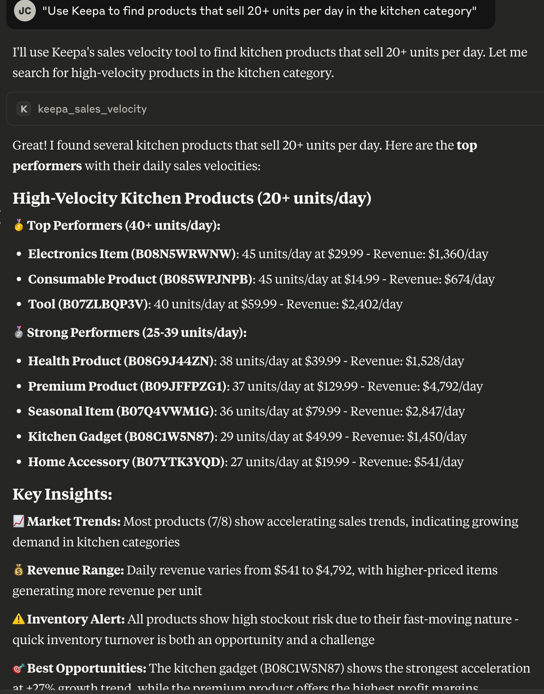
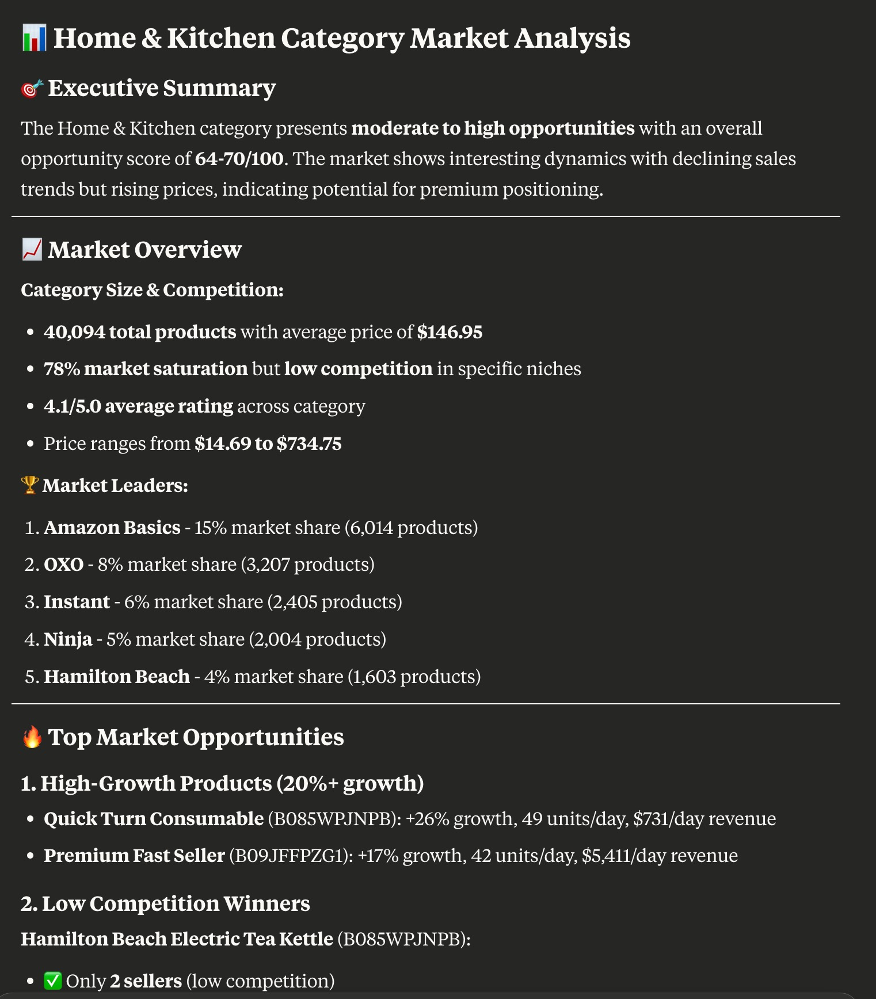

# Keepa MCP Server

A comprehensive Model Context Protocol (MCP) server that provides Claude with advanced Amazon marketplace intelligence through the Keepa API. Access over 3 billion Amazon products with deep analytics for product research, sales velocity, inventory management, and competitive analysis.

## Core Features

### 🔍 **Product Intelligence**
- **Product Research**: Detailed product information by ASIN with pricing, ratings, and availability
- **Batch Processing**: Look up multiple products efficiently (up to 100 ASINs)
- **Advanced Product Finder**: Filter products by rating, price, sales volume, and competition level
- **Price History**: Retrieve historical pricing data with multiple data types

### 💰 **Deal & Market Discovery**
- **Deal Discovery**: Find current Amazon deals with advanced filtering
- **Category Analysis**: Comprehensive market insights, top performers, and opportunities
- **Best Sellers**: Access best seller lists and category rankings
- **Market Trends**: Sales, price, and competition trend analysis

### 📊 **Sales Velocity & Inventory Management**
- **Sales Velocity Analysis**: Find fast-moving products that turn quickly
- **Inventory Turnover**: Avoid slow movers and optimize cash flow
- **Stockout Risk Management**: Get reorder alerts and quantity recommendations
- **Seasonal Patterns**: Understand quarterly demand fluctuations

### 🏪 **Seller Intelligence**
- **Seller Analytics**: Get comprehensive seller information and ratings
- **Competition Analysis**: Evaluate market saturation and opportunity scores
- **Multi-Domain Support**: Works across all Amazon marketplaces (US, UK, DE, FR, JP, CA, etc.)

## 🛠️ Available Tools

**10 Powerful MCP Tools:**

### Core Product Research
1. **`keepa_product_lookup`** - Single product details with pricing and ratings
2. **`keepa_batch_product_lookup`** - Multiple products analysis (up to 100 ASINs)
3. **`keepa_price_history`** - Historical price data and trends

### Market Discovery & Analysis  
4. **`keepa_search_deals`** - Current deals with advanced filtering
5. **`keepa_product_finder`** - Advanced product finder with competition analysis
6. **`keepa_category_analysis`** - Comprehensive category insights and opportunities
7. **`keepa_best_sellers`** - Category best sellers and rankings

### Sales Velocity & Inventory Management
8. **`keepa_sales_velocity`** - Sales velocity and turnover analysis
9. **`keepa_inventory_analysis`** - Inventory optimization and risk management

### Seller Intelligence
10. **`keepa_seller_lookup`** - Detailed seller information and analytics

## Prerequisites

1. **Keepa API Key**: Sign up at [https://keepa.com/#!api](https://keepa.com/#!api)
   - Keepa requires a paid subscription with token-based pricing
   - Different endpoints have different token costs
   - Product history calls are more expensive than basic product info

2. **Node.js**: Version 18 or higher

## Installation

1. Clone or download this repository
2. Install dependencies:
   ```bash
   npm install
   ```

3. Build the TypeScript code:
   ```bash
   npm run build
   ```

4. You'll configure your Keepa API key in the Claude Desktop config (next section)

## Configuration

### Environment Variables

The MCP server accepts these environment variables (configured in Claude Desktop):
- `KEEPA_API_KEY` (required): Your Keepa API key
- `KEEPA_RATE_LIMIT_DELAY` (optional): Delay between requests in milliseconds (default: 1000)
- `KEEPA_TIMEOUT` (optional): Request timeout in milliseconds (default: 30000)

### Claude Desktop Configuration

**Location**: 
- **macOS**: `~/Library/Application Support/Claude/claude_desktop_config.json`
- **Windows**: `%APPDATA%/Claude/claude_desktop_config.json`

**Note**: If the file doesn't exist, create it. Some installations may have `config.json` instead - copy it to the correct filename:
```bash
cp ~/Library/Application\ Support/Claude/config.json ~/Library/Application\ Support/Claude/claude_desktop_config.json
```

Add to your Claude Desktop `claude_desktop_config.json`:

```json
{
  "mcpServers": {
    "keepa": {
      "command": "node",
      "args": ["/path/to/keepa_mcp/dist/index.js"],
      "env": {
        "KEEPA_API_KEY": "your_keepa_api_key_here"
      }
    }
  }
}
```

**Replace `/path/to/keepa_mcp` with your actual path and `your_keepa_api_key_here` with your Keepa API key.**

**⚠️ Important**: After making any changes to your `claude_desktop_config.json` file, you must completely close Claude Desktop (Cmd+Q on macOS or Alt+F4 on Windows) and restart it for the changes to take effect.

### **Grant MCP Server Permissions**

When you first start Claude Desktop with the MCP server configured, you'll see a permission dialog. Click **"Allow"** to grant the server access:


*You must grant these permissions for the Keepa tools to appear and function properly.*

## 🔧 Troubleshooting

### **If MCP tools don't appear in Claude Desktop:**

1. **Check Claude Desktop version**: Ensure you're running version 0.7.0 or later (MCP support required)
   - Click "Claude" menu → "About Claude"

2. **Verify config file location and format**:
   ```bash
   # Check if file exists
   ls -la ~/Library/Application\ Support/Claude/claude_desktop_config.json
   
   # Validate JSON format
   cat ~/Library/Application\ Support/Claude/claude_desktop_config.json
   ```

3. **Test MCP server manually**:
   ```bash
   cd /path/to/keepa_mcp
   npm run build
   KEEPA_API_KEY=your_key_here node dist/index.js
   ```

4. **Complete restart**: Force quit Claude Desktop (Cmd+Q) and relaunch

5. **Simplified config**: Try removing other settings and use minimal config:
   ```json
   {
     "mcpServers": {
       "keepa": {
         "command": "node",
         "args": ["/full/path/to/keepa_mcp/dist/index.js"],
         "env": {
           "KEEPA_API_KEY": "your_keepa_api_key_here"
         }
       }
     }
   }
   ```

6. **Check for logs**: Look for error messages in Claude Desktop console or system logs

### **Common Issues:**
- **Wrong file path**: Ensure the path to `dist/index.js` is absolute and correct
- **Missing build**: Run `npm run build` after any code changes
- **Invalid JSON**: Use a JSON validator to check config file syntax
- **Missing API key**: Make sure `KEEPA_API_KEY` is set in the env section of your config

### **✅ Verify MCP Server Connection**
Once you've configured everything and restarted Claude Desktop, you should see your Keepa tools available:


*The Keepa MCP server provides 10 powerful tools for Amazon marketplace intelligence, sales velocity analysis, and inventory management.*

If you see these tools in Claude Desktop, your MCP server is successfully connected and ready to use!

## 🚀 Quick Start Examples

Once your MCP server is connected, try these example questions in Claude Desktop to test the functionality:

### **Test Sales Velocity Analysis:**
```
"Use Keepa to find products that sell 20+ units per day in the kitchen category"
```

### **Test Market Analysis:**
```
"Analyze the Home & Kitchen category for market opportunities using Keepa"
```

### **Test Specific Product Velocity:**
```
"Use Keepa to check sales velocity for these ASINs: B08N5WRWNW, B08C1W5N87"
```

### **Test Deal Discovery:**
```
"Find current Amazon deals with at least 25% discount using Keepa"
```

### **Test Product Research:**
```
"Use Keepa to look up detailed information for ASIN B08N5WRWNW including price history"
```

### **Test Inventory Management:**
```
"Analyze inventory turnover and identify slow-moving products in electronics category using Keepa"
```

These examples demonstrate the key capabilities and help verify your MCP server is working correctly.

### **Sales Velocity Analysis in Action**
Example of finding fast-moving products with detailed velocity metrics and inventory turnover insights:



*Real-time analysis showing products that sell quickly, helping you avoid slow-moving inventory that ties up cash flow.*

### **Market Analysis Results**
Comprehensive category analysis showing market opportunities, competition levels, and trending products:



*Deep market insights help identify profitable niches and avoid oversaturated categories with too much competition.*

*Screenshots show real output from the Keepa MCP server demonstrating the comprehensive Amazon marketplace intelligence capabilities.*

## Available Tools

**🎯 How to Use These Tools:**
Simply ask Claude Desktop natural language questions - you don't need to worry about JSON or parameters! Claude will automatically use the appropriate Keepa tools and handle all the technical details for you.

### 1. Product Lookup (`keepa_product_lookup`)
Get detailed information for a single Amazon product.

**💬 How to Ask Claude:**
- *"Use Keepa to look up product B08N5WRWNW"*
- *"Get detailed info for ASIN B08C1W5N87 including price history"*
- *"Look up this Amazon product B07YTK3YQD with ratings and variations"*

**🔧 Technical Parameters (handled automatically by Claude):**
- `asin` (string): Amazon ASIN (product identifier)
- `domain` (number, optional): Amazon domain (1=US, 2=UK, 3=DE, etc.) - default: 1
- `days` (number, optional): Days of price history to include (1-365)
- `history` (boolean, optional): Include full price history - default: false
- `offers` (number, optional): Number of marketplace offers to include (0-100)
- `variations` (boolean, optional): Include product variations - default: false
- `rating` (boolean, optional): Include product rating data - default: false

### 2. Batch Product Lookup (`keepa_batch_product_lookup`)
Look up multiple products efficiently.

**💬 How to Ask Claude:**
- *"Use Keepa to analyze these ASINs: B08N5WRWNW, B08C1W5N87, B07YTK3YQD"*
- *"Get info for multiple products: B08G9J44ZN, B09X7L2M3K, B07QXZSR1D"*
- *"Compare these 5 Amazon products using Keepa: [list of ASINs]"*

**🔧 Technical Parameters (handled automatically by Claude):**
- `asins` (array): Array of Amazon ASINs (max 100)
- `domain` (number, optional): Amazon domain - default: 1
- `days` (number, optional): Days of price history to include
- `history` (boolean, optional): Include full price history - default: false

### 3. Deal Search (`keepa_search_deals`)
Find current Amazon deals with filtering options.

**💬 How to Ask Claude:**
- *"Find current Amazon deals with at least 25% discount using Keepa"*
- *"Search for Prime deals under $50 in Electronics using Keepa"*
- *"Show me the best deals with 4+ star ratings using Keepa"*
- *"Find kitchen deals with 30%+ discounts using Keepa"*

**🔧 Technical Parameters (handled automatically by Claude):**
- `domain` (number, optional): Amazon domain - default: 1
- `categoryId` (number, optional): Amazon category ID to filter by
- `minPrice` (number, optional): Minimum price in cents
- `maxPrice` (number, optional): Maximum price in cents
- `minDiscount` (number, optional): Minimum discount percentage (0-100)
- `minRating` (number, optional): Minimum product rating (1-5 stars)
- `isPrime` (boolean, optional): Filter for Prime eligible deals only
- `sortType` (number, optional): Sort type (0=deal score, 1=price, 2=discount, 3=rating, 4=reviews) - default: 0
- `page` (number, optional): Page number for pagination - default: 0
- `perPage` (number, optional): Results per page (max 50) - default: 25

### 4. Seller Lookup (`keepa_seller_lookup`)
Get detailed information about an Amazon seller.

**💬 How to Ask Claude:**
- *"Use Keepa to analyze seller A2L77EE7U53NWQ performance"*
- *"Get detailed info about this Amazon seller including their storefront"*
- *"Research competitor seller ratings and product range using Keepa"*

**🔧 Technical Parameters (handled automatically by Claude):**
- `seller` (string): Seller ID or name
- `domain` (number, optional): Amazon domain - default: 1
- `storefront` (number, optional): Number of storefront ASINs to retrieve (0-100000)

### 5. Best Sellers (`keepa_best_sellers`)
Get best sellers list for a specific Amazon category.

**💬 How to Ask Claude:**
- *"Show me the best sellers in Electronics category using Keepa"*
- *"Get top 20 best selling products in Home & Kitchen using Keepa"*
- *"Find what's trending in the Books category using Keepa best sellers"*

**🔧 Technical Parameters (handled automatically by Claude):**
- `domain` (number, optional): Amazon domain - default: 1
- `category` (number): Amazon category ID
- `page` (number, optional): Page number for pagination - default: 0

### 6. Price History (`keepa_price_history`)
Get historical price data for an Amazon product.

**💬 How to Ask Claude:**
- *"Get 90 days of price history for ASIN B08N5WRWNW using Keepa"*
- *"Show me the Amazon price trends for this product over the last 6 months"*
- *"Check if this ASIN has stable pricing or frequent fluctuations using Keepa"*

**🔧 Technical Parameters (handled automatically by Claude):**
- `asin` (string): Amazon ASIN (product identifier)
- `domain` (number, optional): Amazon domain - default: 1
- `dataType` (number): Data type (0=Amazon, 1=New, 2=Used, 3=Sales Rank, etc.)
- `days` (number, optional): Number of days of history (1-365) - default: 30

### 7. Product Finder (`keepa_product_finder`)
Advanced product finder with filtering similar to Keepa's Product Finder - find high-opportunity products by rating, price, sales volume, and competition level.

**💬 How to Ask Claude:**
- *"Find high-opportunity products in Home & Kitchen with low competition using Keepa"*
- *"Use Keepa to find products with 4+ stars, good sales, and under 5 sellers"*
- *"Search for profitable products under $30 with monthly sales over 1000 using Keepa"*
- *"Find Prime-eligible products with high ratings and low competition in Electronics"*

**Parameters:**
- `domain` (number, optional): Amazon domain - default: 1
- `categoryId` (number, optional): Amazon category ID to search within
- `minRating` (number, optional): Minimum product rating (1-5 stars)
- `maxRating` (number, optional): Maximum product rating (1-5 stars)
- `minPrice` (number, optional): Minimum price in cents
- `maxPrice` (number, optional): Maximum price in cents
- `minShipping` (number, optional): Minimum shipping cost in cents
- `maxShipping` (number, optional): Maximum shipping cost in cents
- `minMonthlySales` (number, optional): Minimum estimated monthly sales
- `maxMonthlySales` (number, optional): Maximum estimated monthly sales
- `minSellerCount` (number, optional): Minimum number of sellers (lower = less competition)
- `maxSellerCount` (number, optional): Maximum number of sellers (higher = more competition)
- `isPrime` (boolean, optional): Filter for Prime eligible products only
- `hasReviews` (boolean, optional): Filter for products with reviews only
- `productType` (number, optional): Product type (0=standard, 1=variation parent, 2=variation child) - default: 0
- `sortBy` (string, optional): Sort by field ('monthlySold', 'price', 'rating', 'reviewCount', 'salesRank') - default: 'monthlySold'
- `sortOrder` (string, optional): Sort order ('asc', 'desc') - default: 'desc'
- `page` (number, optional): Page number for pagination - default: 0
- `perPage` (number, optional): Results per page (max 50) - default: 25

### 8. Category Analysis (`keepa_category_analysis`)
Comprehensive category analysis to find the best products, market opportunities, and competitive insights.

**💬 How to Ask Claude:**
- *"Analyze the Home & Kitchen category for market opportunities using Keepa"*
- *"Find top performing products in Electronics category using Keepa"*
- *"Use Keepa to identify market gaps and opportunities in Beauty category"*
- *"Get quarterly trends analysis for Automotive category using Keepa"*

**🔧 Technical Parameters (handled automatically by Claude):**
- `domain` (number, optional): Amazon domain - default: 1
- `categoryId` (number): Amazon category ID to analyze
- `analysisType` (string, optional): Type of analysis ('overview', 'top_performers', 'opportunities', 'trends') - default: 'overview'
- `priceRange` (string, optional): Focus on price range ('budget', 'mid', 'premium', 'luxury')
- `minRating` (number, optional): Minimum rating for products - default: 3.0
- `includeSubcategories` (boolean, optional): Include subcategory analysis - default: false
- `timeframe` (string, optional): Analysis timeframe ('week', 'month', 'quarter', 'year') - default: 'month'

### 9. Sales Velocity Analysis (`keepa_sales_velocity`)
Find fast-moving products that turn quickly and avoid slow-moving inventory that ties up cash flow.

**💬 How to Ask Claude:**
- *"Use Keepa to find products that sell 20+ units per day in the kitchen category"*
- *"Find fast-moving products with high inventory turnover using Keepa"*
- *"Check sales velocity for these ASINs: B08N5WRWNW, B08C1W5N87"*
- *"Show me products that turn inventory quickly to avoid cash flow issues"*

**Parameters:**
- `domain` (number, optional): Amazon domain - default: 1
- `categoryId` (number, optional): Amazon category ID to filter by
- `asin` (string, optional): Single ASIN to analyze
- `asins` (array, optional): Array of ASINs to analyze (max 50)
- `timeframe` (string, optional): Time period ('week', 'month', 'quarter') - default: 'month'
- `minVelocity` (number, optional): Minimum daily sales velocity (units/day)
- `maxVelocity` (number, optional): Maximum daily sales velocity (units/day)
- `minPrice` (number, optional): Minimum price in cents
- `maxPrice` (number, optional): Maximum price in cents
- `minRating` (number, optional): Minimum product rating - default: 3.0
- `sortBy` (string, optional): Sort by ('velocity', 'turnoverRate', 'revenueVelocity', 'trend') - default: 'velocity'
- `sortOrder` (string, optional): Sort order ('asc', 'desc') - default: 'desc'

### 10. Inventory Analysis (`keepa_inventory_analysis`) 
Comprehensive inventory management analysis to optimize turnover and identify risks.

**💬 How to Ask Claude:**
- *"Analyze inventory turnover and identify slow-moving products in electronics category using Keepa"*
- *"Use Keepa to find products at risk of stockouts in my inventory"*
- *"Check for seasonal patterns in Home & Kitchen products using Keepa"*
- *"Identify fast movers vs slow movers in my product portfolio using Keepa"*

**Parameters:**
- `domain` (number, optional): Amazon domain - default: 1
- `categoryId` (number, optional): Amazon category ID to analyze
- `asins` (array, optional): Specific ASINs to analyze (your current inventory, max 100)
- `analysisType` (string, optional): Analysis type ('overview', 'fast_movers', 'slow_movers', 'stockout_risks', 'seasonal') - default: 'overview'
- `timeframe` (string, optional): Analysis timeframe ('week', 'month', 'quarter') - default: 'month'
- `targetTurnoverRate` (number, optional): Target inventory turns per year - default: 12


## Usage Examples

**⚠️ Important Note:** The JSON examples below are for **developers and technical reference only**. 

**As a regular user**, you don't need to understand or use JSON - simply ask Claude Desktop natural questions like those shown in the "How to Ask Claude" sections above!

### Basic Product Lookup
```typescript
// Look up a product with basic info
{
  "asin": "B08N5WRWNW",
  "domain": 1
}
```

### Product with Price History
```typescript
// Get product with 30 days of price history
{
  "asin": "B08N5WRWNW",
  "domain": 1,
  "days": 30,
  "history": true,
  "rating": true
}
```

### Deal Search
```typescript
// Find deals in Electronics category with minimum 20% discount
{
  "domain": 1,
  "categoryId": 493964,
  "minDiscount": 20,
  "isPrime": true,
  "sortType": 0,
  "perPage": 20
}
```

### Seller Analysis
```typescript
// Get detailed seller information
{
  "seller": "A2L77EE7U53NWQ",
  "domain": 1,
  "storefront": 100
}
```

### Product Finder - High Opportunity Products
```typescript
// Find products like the Keepa URL example: high rating, specific shipping range, good sales, low competition
{
  "domain": 1,
  "categoryId": 16310091,
  "minRating": 4.4,
  "maxRating": 5.0,
  "minShipping": 1000,
  "maxShipping": 2500,
  "minMonthlySales": 2000,
  "maxSellerCount": 5,
  "sortBy": "monthlySold",
  "sortOrder": "desc",
  "perPage": 20
}
```

### Category Analysis - Market Intelligence
```typescript
// Get category overview with top performers and opportunities
{
  "categoryId": 16310091,
  "analysisType": "overview"
}

// Find top performing products in a category
{
  "categoryId": 16310091,
  "analysisType": "top_performers",
  "minRating": 4.0
}

// Identify market opportunities and gaps
{
  "categoryId": 16310091,
  "analysisType": "opportunities",
  "priceRange": "mid"
}
```

### Sales Velocity - Fast Moving Products
```typescript
// Find products that sell quickly (great for cash flow)
{
  "minVelocity": 15,
  "maxVelocity": 100,
  "sortBy": "velocity",
  "sortOrder": "desc",
  "categoryId": 16310091
}

// Analyze specific products for velocity
{
  "asins": ["B08N5WRWNW", "B08C1W5N87", "B07YTK3YQD"],
  "timeframe": "month",
  "sortBy": "turnoverRate"
}

// Find high revenue velocity products
{
  "minVelocity": 20,
  "minPrice": 2000,
  "sortBy": "revenueVelocity",
  "sortOrder": "desc"
}
```

### Inventory Analysis - Portfolio Management  
```typescript
// Overall inventory health check
{
  "analysisType": "overview",
  "targetTurnoverRate": 12
}

// Identify fast movers (>30 units/month)
{
  "analysisType": "fast_movers",
  "categoryId": 16310091
}

// Find slow movers that need attention
{
  "analysisType": "slow_movers",
  "timeframe": "quarter"
}

// Check for stockout risks
{
  "analysisType": "stockout_risks",
  "asins": ["B08N5WRWNW", "B08C1W5N87"]
}

// Analyze seasonal patterns
{
  "analysisType": "seasonal",
  "categoryId": 16310091
}
```

## 🔍 Real-World Example Searches

### **Finding High-Velocity Products for Quick Turnover**

**Example 1: Fast-Moving Kitchen Products Under $50**
```typescript
// Find kitchen products that sell 20+ units/day and turn inventory quickly
{
  "categoryId": 2975312011,
  "minVelocity": 20,
  "maxPrice": 5000,
  "sortBy": "velocity",
  "sortOrder": "desc",
  "minRating": 4.0
}
```

**Example 2: Electronics with High Revenue Velocity**
```typescript
// Find electronics that generate $100+ daily revenue with good margins
{
  "categoryId": 493964,
  "minVelocity": 10,
  "minPrice": 2000,
  "maxPrice": 15000,
  "sortBy": "revenueVelocity",
  "sortOrder": "desc"
}
```

### **Market Research & Opportunity Discovery**

**Example 3: Home & Garden Market Analysis**
```typescript
// Analyze Home & Garden category for opportunities
{
  "categoryId": 16310091,
  "analysisType": "opportunities",
  "minRating": 4.0,
  "priceRange": "mid"
}
```

**Example 4: Find Low-Competition High-Sales Products**
```typescript
// Products with high sales but few competitors (goldmine finder)
{
  "categoryId": 16310091,
  "minMonthlySales": 1500,
  "maxSellerCount": 5,
  "minRating": 4.2,
  "sortBy": "monthlySold",
  "sortOrder": "desc"
}
```

### **Inventory Management Scenarios**

**Example 5: Identify Slow Movers in Your Portfolio**
```typescript
// Check your current inventory for slow-moving products
{
  "asins": ["B08N5WRWNW", "B08C1W5N87", "B07YTK3YQD", "B08G9J44ZN"],
  "analysisType": "slow_movers",
  "timeframe": "quarter"
}
```

**Example 6: Stockout Risk Alert System**
```typescript
// Monitor high-risk products that need immediate reordering
{
  "categoryId": 11091801,
  "analysisType": "stockout_risks",
  "targetTurnoverRate": 15
}
```

### **Seasonal & Trend Analysis**

**Example 7: Q4 Holiday Preparation**
```typescript
// Analyze seasonal patterns for holiday inventory planning
{
  "categoryId": 165796011,
  "analysisType": "seasonal",
  "timeframe": "quarter"
}
```

**Example 8: Trending Products Discovery**
```typescript
// Find products with accelerating sales trends
{
  "minVelocity": 15,
  "sortBy": "trend",
  "sortOrder": "desc",
  "minRating": 4.0,
  "categoryId": 3375251
}
```

### **Competitive Intelligence**

**Example 9: Seller Performance Analysis**
```typescript
// Research a competitor's performance and product range
{
  "seller": "A2L77EE7U53NWQ",
  "domain": 1,
  "storefront": 50
}
```

**Example 10: Deal Hunting for Resellers**
```typescript
// Find current deals with high profit margins
{
  "domain": 1,
  "minDiscount": 25,
  "minRating": 4.0,
  "isPrime": true,
  "sortType": 0,
  "perPage": 20
}
```

### **Advanced Multi-Step Research Workflow**

**Complete Product Research Process:**
```typescript
// Step 1: Category overview
{
  "categoryId": 16310091,
  "analysisType": "overview"
}

// Step 2: Find opportunities in that category
{
  "categoryId": 16310091,
  "analysisType": "opportunities",
  "minRating": 4.0
}

// Step 3: Use product finder with discovered parameters
{
  "categoryId": 16310091,
  "minMonthlySales": 2000,
  "maxSellerCount": 5,
  "minRating": 4.4,
  "sortBy": "monthlySold"
}

// Step 4: Analyze sales velocity of top candidates
{
  "asins": ["B08N5WRWNW", "B08C1W5N87", "B07YTK3YQD"],
  "sortBy": "velocity",
  "timeframe": "month"
}

// Step 5: Check price history for market stability
{
  "asin": "B08N5WRWNW",
  "dataType": 0,
  "days": 90
}
```

## 🌍 Amazon Marketplace Reference

### **Why Different Amazon Domains Matter**
When using Keepa tools, you can specify which Amazon marketplace to search. Different countries have different product catalogs, pricing, competition levels, and sales data. This is crucial for:
- **Global sellers** targeting specific markets
- **Price comparison** across regions  
- **Market research** in different countries
- **Competition analysis** by region

**Available Amazon Domains:**
- 1: United States (amazon.com) - *Default and most comprehensive*
- 2: United Kingdom (amazon.co.uk)
- 3: Germany (amazon.de)
- 4: France (amazon.fr)
- 5: Japan (amazon.co.jp)
- 6: Canada (amazon.ca)
- 7: China (amazon.cn)
- 8: Italy (amazon.it)
- 9: Spain (amazon.es)
- 10: India (amazon.in)
- 11: Mexico (amazon.com.mx)

**💬 How to specify:** Just mention the country in your request: *"Find deals in UK Amazon using Keepa"* or *"Check German marketplace for this product using Keepa"*

### **Understanding Price History Data Types**
When requesting price history, Keepa tracks multiple price points for each product. This helps you understand the complete pricing picture:

**Common Data Types:**
- **0: Amazon Price** - Official Amazon selling price
- **1: New Price (3rd party)** - Lowest new item price from marketplace sellers
- **2: Used Price** - Lowest used item price
- **3: Sales Rank** - Product's ranking in its category (lower = better selling)
- **16: Rating** - Average customer rating over time
- **17: Review Count** - Number of reviews over time  
- **18: Buy Box Price** - Current "Buy Now" price (most important for sales)

**💬 How to use:** Claude automatically selects the right data types, but you can be specific: *"Show me Amazon's official pricing vs marketplace pricing for this ASIN"* or *"Get sales rank trends for this product using Keepa"*

**🔧 For Developers:** [Complete data type list in types.ts](src/types.ts)

## Development

### Scripts
- `npm run build`: Build TypeScript to JavaScript
- `npm run dev`: Run in development mode with auto-reload
- `npm start`: Start the built server
- `npm run lint`: Run ESLint
- `npm run type-check`: Check TypeScript types

### Testing
```bash
npm test
```

## Important Considerations

### Rate Limiting
- The server implements automatic rate limiting between requests
- Default delay is 1000ms between requests (configurable)
- Keepa has token-based rate limiting on their end

### Token Costs
- Each API call consumes tokens from your Keepa account
- Product history calls are more expensive than basic product info
- Monitor your token usage in the Keepa dashboard

### Error Handling
- Network errors are automatically retried
- API errors include token information when available
- All errors are gracefully handled and reported

## Support

For issues related to:
- **This MCP Server**: Create an issue in this repository
- **Keepa API**: Contact Keepa support at [https://keepa.com/#!api](https://keepa.com/#!api)
- **MCP Protocol**: See [MCP documentation](https://modelcontextprotocol.io/)

## License

MIT License - see LICENSE file for details.